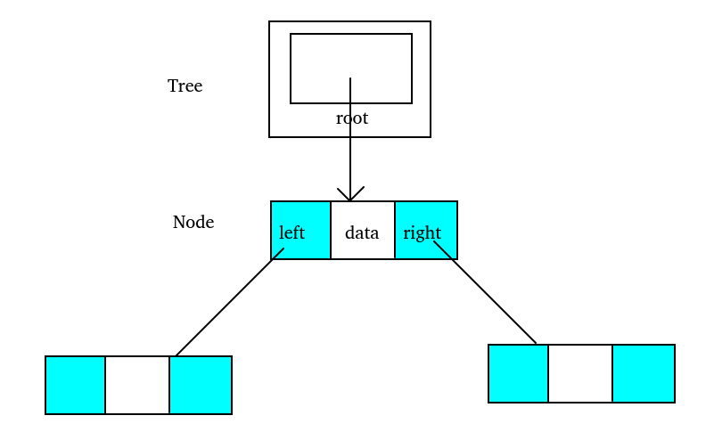
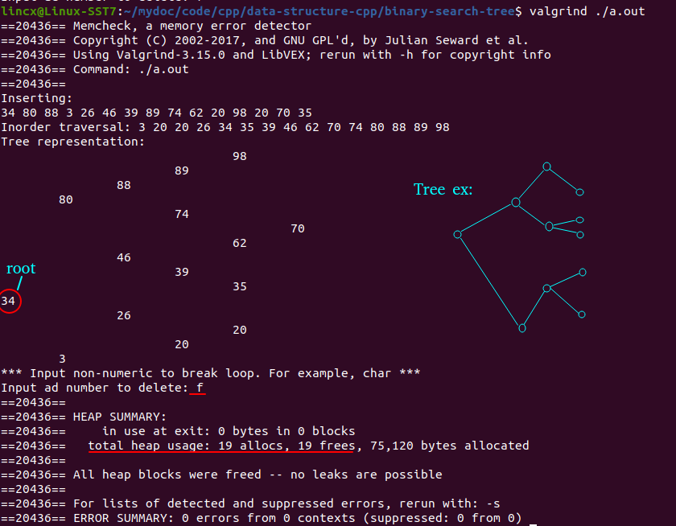

# 📕 C++实现Binary search tree

### 📖 Data Structure:
```c++
struct Node {
	int data;
	Node* left;
	Node* right;
	Node() : data(0), left(nullptr), right(nullptr) {}
	Node(int data) : data(data), left(nullptr), right(nullptr) {}
};

struct Tree {
	Node* root;
	Tree() : root(nullptr) {}
};
```
<div  align="center"><kbd>  
    
</kbd></div><br>  
总共有两个结构体:  
Node即为存放数据的节点, Tree用来存放tree的root。

### 📖 Result
* 输入非int类型可以退出循环。如截图中红线标出的‘f’
* 通过valgrind可以看到分配的内存全部被释放
<div  align="center"><kbd>  
    
</kbd></div>  

### 📖 Function Description
```c++
Tree* BST_create();                     // 创建并初始化tree结构体
void add_BST(Node* &root, int data);    // 插入node
int BST_insert(Tree* pTree, int data);  // 调用add_BST以插入node
void _traverse(Node* root);             // 按从小到大排序输出节点data
void BST_traverse(Tree* pTree);         // 调用_traverse以按从小到大排序输出node的data
void largest_BST(Node* root, Node* &pPre);  // 找到并定位pPre到最大的node
Node* _delete(Node* root, int data, int &success);  // 删除node
int BST_delete(Tree* pTree, int data);              // 调用_delete以删除node
void _destroy(Node* root);              // 释放整个tree的内存
Tree* BST_destroy(Tree* pTree);         // 调用_destroy以释放整个tree的内存
void print_tree(Tree* pTree);           // 调用_infix_print以打印tree
void _infix_print(Node* root, int level);   // 打印tree
```
至于为什么总是在函数中调用另一个函数来实现一个功能，比如在BST_insert中调用add_BST来实现insert，因为希望实现功能时只用传入tree和相关数据而不用考虑格式问题(指针，双指针，引用等)，格式的问题在BST_insert中转换，真正实现在add_BST中。这样在main中使用的时候就会方便很多。