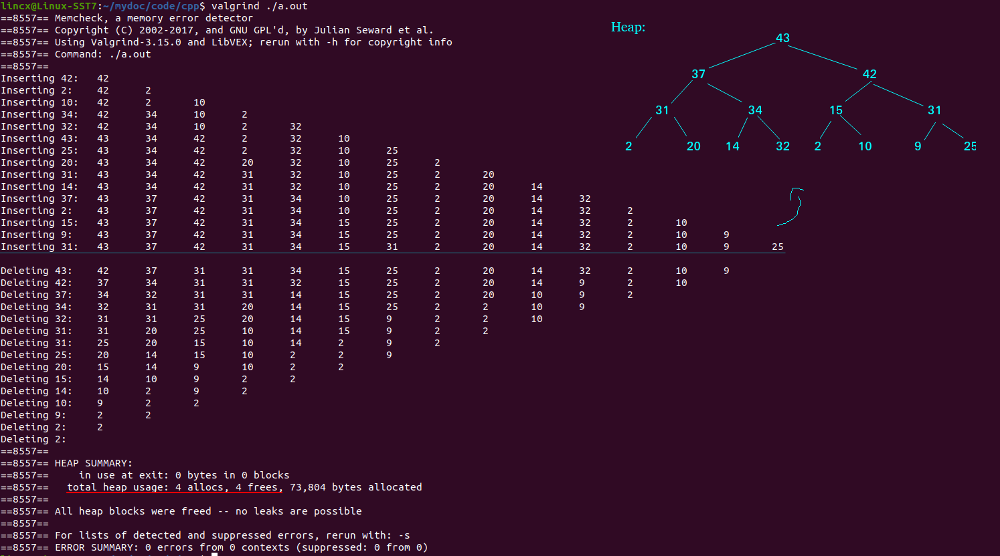

# 📕 C++实现Max Heap

* About [Heap](https://en.wikipedia.org/wiki/Heap_(data_structure))

### 📖 Data structure

```c++
struct Heap {
	int* heapArr;
	int last;
	int capacity;
	// constructor
	Heap() : heapArr(new int[MAX_ELEMENT]), last(-1), capacity(0) {}
	// destructor
	~Heap() {
		if (heapArr != nullptr) {
			delete[] heapArr;
			heapArr = nullptr;
		}
	}
};
```

### 📖 Running

```c++
int main(int args, char** argv) {
	Heap* heap = new Heap();                    // Create Heap
	int data;

	srand((unsigned)time(NULL));
	for (int i = 0; i < MAX_ELEMENT; ++i) {     // Generate random number
		data = random(1, MAX_ELEMENT*3);
		cout << "Inserting " << data << ": ";   // Print random number

		// insert node
		heapInsert(heap, data);                 // Insert random number to Heap
		heapPrint(heap);                        // Print Heap every iteration
	}

	cout << endl;

	while (heap->last >= 0) {
		heapDelete(heap, data);                 // Delete max number in Heap
		cout << "Deleting " << data << ": ";    // Print max number
		heapPrint(heap);                        // Print Heap every iteration
	}

	// memory free
	delete heap;
	return 0;
}
```


### 📖 Result



