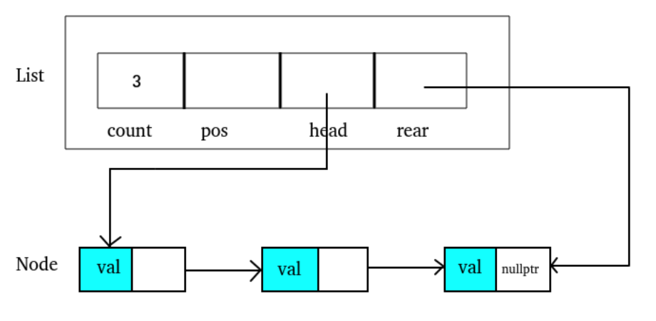
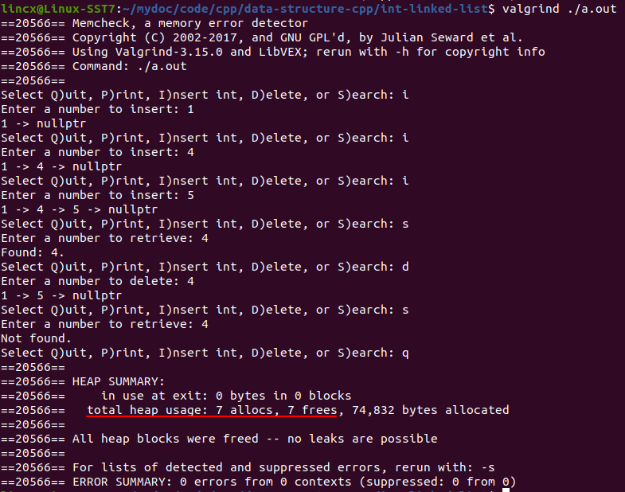

# 📕 C++实现linked list
先实现一个简单的int数据的有序linked list  
注释掉的部分是用引用代替双指针操作


### 📖 Data Structure:
```c++
struct Node {
	int val;
	Node *next;
	// constructor
	Node() : val(0), next(nullptr) {}
	Node(int x) : val(x), next(nullptr) {}
	Node(int x, Node *next) : val(x), next(next) {}
};

struct List {
	int count;
	Node *pos;
	Node *head;	// first node
	Node *rear;	// last node
	// constructor
	List() : count(0), pos(nullptr), head(nullptr), rear(nullptr) {}
};
```
<div  align="center"><kbd>  
    
</kbd></div><br>  
总共有两个结构体
Node即为存放数据的节点。  
List用来存储信息如目前节点数(count), 第一个node和最后一个node(head, rear)。

### 📖 Result  
* 截图中有简单的插入，搜索，删除，退出操作。
* 退出时会释放分配的内存，使用valgrind查看。截图红线处是分配和释放内存数。  

<div  align="center"><kbd>  
    
</kbd></div>  

### 📖 Function Description
这个程序有以下函数，接下来进行说明。简单的函数就用注释说明，稍微需要字数说明的放在下面。
```c++
int compare(int a, int b);  		// 比较a和b，因为是有序链表所以需要通过判断大小来判断是否要进入next node
List *create_list();        		// 创建list
List *destroy_list(List *pList);    // 结束时释放内存
int list_count(List *pList);        // 返回目前node数
bool isEmpty(List *pList);          // 返回目前有无node
void print_list(List *pList);       // 打印linked list

int add_node(List *pList, int data);                                // 查找并判断node是否存在，存在则调用_insert
int remove_node(List *pList, int Key, int *dataOut);                // 查找并判断node是否存在，存在则调用_delete
int search_list(List *pList, int Key, int *dataOut);                // 搜索函数
int _insert(List *pList, Node *pPre, int data);                     // 插入node
void _delete(List *pList, Node *pPre, Node *pLoc, int *dataOut);    // 删除node
int _search(List *pList, Node **pPre, Node **pLoc, int argu);       // 搜索并定位node
```
* _search(List *pList, Node **pPre, Node **pLoc, int argu)
    * 搜索linked list中的node，如果该node存在则通过双指针操作把pLoc连接该node，把pPre连接前一个node  
    
* int add_node(List *pList, int data)
    * 该函数中会创建pPre并调用_search函数将pPre传入，以进行搜索查看要输入的值是否已存在。
    * 如果存在则不添加，不存在则通过双指针操作将pPre节点放在比他大的node的前面比他小的node的后面。
    * 这样在后面添加的时候不用再一次寻找inert的位置而是直接放在pPre处即可。  


* remove_node(List *pList, int Key, int *dataOut)
    * 其实逻辑上和add_node()同理，也是先调用_search检查有没有该node，依旧是通过双指针操作pLoc在_search中就对要删除的node进行定位。在_delete()函数中直接删除而不用再次检索要删除的node的位置。